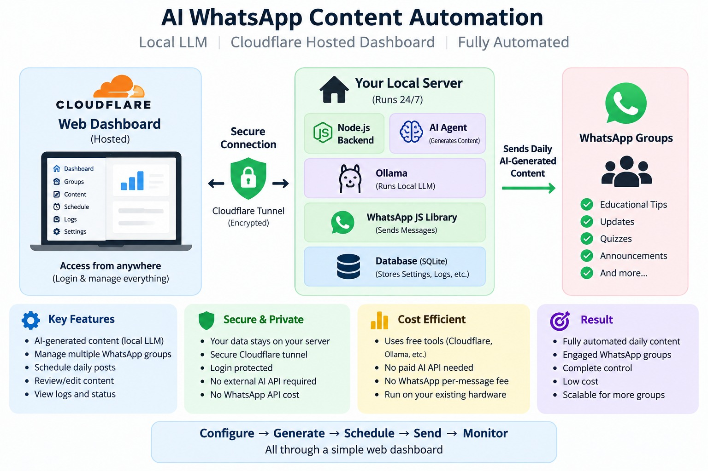
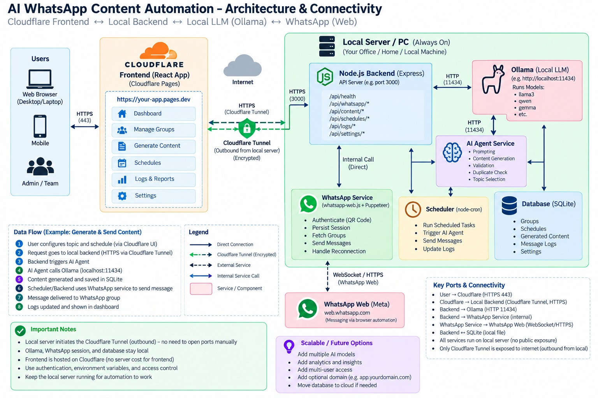
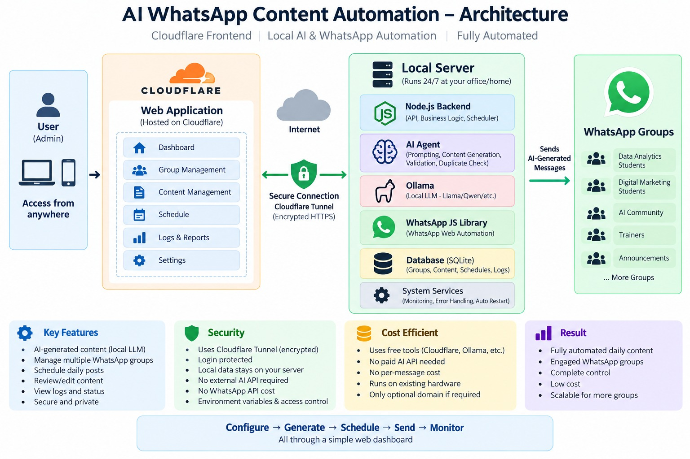
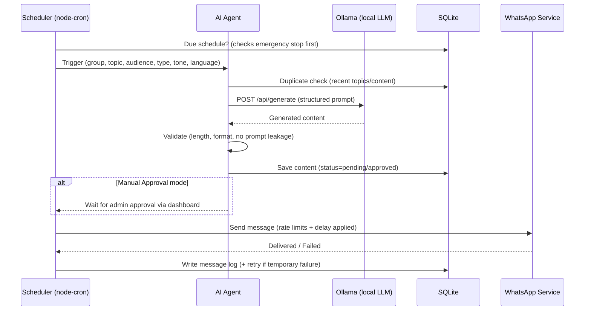

# First Deliverable — Project Proposal

**Project:** AI-Powered WhatsApp Daily Content Automation using Local LLM (Ollama), whatsapp-web.js and Cloudflare
**Deliverable:** Pre-development proposal (Task Document, Section 62)
**Status:** Draft for approval
**Date:** 21 September 2026

---

## 1. Proposed Architecture

The system is split into a **cloud control plane** (Cloudflare) and a **local automation plane** (always-on local server). All AI generation, WhatsApp automation, scheduling and data storage happen **only on the local server**. Cloudflare hosts only the React dashboard and provides the secure entry point to the local API.







### Components

| Plane | Component | Responsibility |
|---|---|---|
| Cloudflare | React SPA (Cloudflare Pages) | Login, Dashboard, WhatsApp page, Groups, Content, Schedules, Logs, Settings |
| Cloudflare | Cloudflare Tunnel + Access | Encrypted, outbound-only tunnel to the local API; zero-trust edge authentication |
| Local | Node.js/Express backend | REST API, business logic, auth, health reporting |
| Local | AI Agent service | Prompting, content generation via Ollama, validation, duplicate check, formatting |
| Local | Ollama + local LLM | On-device content generation — **no paid AI API** |
| Local | WhatsApp service (whatsapp-web.js) | QR authentication, session persistence, group detection, message sending |
| Local | Scheduler (node-cron) | Time-based triggers; runs locally so automation continues when the browser is closed |
| Local | SQLite database | Groups, schedules, content, logs, settings |

### Key architectural decisions

1. **Local-first automation.** The scheduler, AI agent, WhatsApp session and database live on the local server. Closing the Cloudflare website never interrupts automation.
2. **Cloudflare is stateless.** The dashboard holds no data; it reads/writes everything through the API. If the tunnel is down, the dashboard reports "Local server offline" but the local scheduler keeps running.
3. **Outbound-only connectivity.** The local server initiates the Cloudflare Tunnel (outbound HTTPS). No router port-forwarding, no public IP, no direct internet exposure of the local machine.
4. **Two automation modes.** Default is *Manual Approval* (generate → review → approve → send). *Automatic* mode (generate → validate → send → log) is an explicit admin setting, guarded by validation and an emergency stop.

### Automated workflow (scheduled run)



---

## 2. Technology Stack

| Layer | Choice | Why | Cost |
|---|---|---|---|
| Frontend | **React 18 + Vite + TypeScript**, Tailwind CSS | Fast dev server, typed API client, responsive UI | Free |
| Frontend hosting | **Cloudflare Pages** (free tier) | Static hosting with global CDN; `*.pages.dev` domain for MVP | Free |
| Backend | **Node.js 20 LTS + Express** | Single language across stack; huge ecosystem | Free |
| Validation | **Zod** | Input validation on every route (security requirement) | Free |
| AI runtime | **Ollama** | Local LLM server with OpenAI-compatible API on `localhost:11434` | Free |
| LLM | **Qwen3 8B (Q4)** — see §4 | Best quality-per-RAM for multilingual instruct tasks | Free |
| WhatsApp | **whatsapp-web.js** (+ bundled Puppeteer) — see §5 | QR login, `LocalAuth` session persistence, group APIs | Free |
| Database | **SQLite** via **better-sqlite3** | Zero-config, file-based, synchronous API ideal for low-volume writes | Free |
| Scheduler | **node-cron** | In-process cron; simple and reliable for the MVP | Free |
| Auth | **bcrypt** password hashing + **JWT** (jsonwebtoken) | Stateless API auth, short-lived tokens | Free |
| Security middleware | **helmet**, **cors** (allow-list: Pages origin), **express-rate-limit** | Baseline hardening (task §39) | Free |
| Logging | **pino** | Fast structured logs; feeds the Logs page | Free |
| Tunnel | **cloudflared** + Cloudflare Access (free plan) | Secure local↔cloud link (task §38) | Free |

**Explicitly excluded for MVP:** paid AI APIs, WhatsApp Business/Cloud API, paid monitoring, dedicated hardware, custom domain purchases (a `*.pages.dev` hostname and free tunnel subdomain are sufficient; a custom domain can be attached later at no infrastructure cost).

---

## 3. Secure Cloudflare ↔ Local Server Communication

This is the highest-risk part of the design (task §38, §39), so it is specified in detail.

### How the connection works

1. `cloudflared` runs as a service on the local server and makes an **outbound** TLS connection to Cloudflare's edge. Nothing is opened inbound on the router/firewall.
2. A **named tunnel** maps a hostname (e.g. `api-<team>.<domain>.dev` or a free `trycloudflare.com` URL during Phase 1) to the local backend at `http://localhost:4000`.
3. The React app on `https://<app>.pages.dev` calls the API hostname over HTTPS (port 443). Traffic path: **Browser → Cloudflare edge (HTTPS) → Tunnel (encrypted) → localhost:4000**.
4. The backend binds to `127.0.0.1` only, so it is unreachable from the LAN/internet except through the tunnel.

### Authentication (three layers)

| Layer | Mechanism | Protects |
|---|---|---|
| Edge | **Cloudflare Access** application on the API hostname (email OTP / GitHub SSO; service token for machine access) | Anyone on the internet reaching the tunnel at all |
| Application | **JWT issued by `POST /api/auth/login`** (bcrypt-hashed credentials in `users` table); sent as `Authorization: Bearer <token>` | Unauthenticated use of the API even if Access is bypassed on the local network |
| Operational | Rate limiting, Zod input validation, `helmet` headers, audit fields on every mutating action | Abuse, injection, and missing accountability |

### HTTPS

Terminated at Cloudflare's edge with automatic certificates; the tunnel leg is mTLS-encrypted by Cloudflare. No certificate management on the local server. During Phase 1 (pure-local testing), the dashboard may talk to `http://localhost:4000` directly before the tunnel is introduced in Phase 2.

### CORS

The API's CORS policy is an explicit allow-list containing only the Pages origin (e.g. `https://<app>.pages.dev`), configured via environment variable. Credentials mode enabled for the JWT header; all other origins rejected.

### Local server access

- Ollama (`11434`), SQLite (file) and the WhatsApp session directory are **never** proxied through the tunnel. Only the Express API is.
- The tunnel ingress config exposes exactly one service: `localhost:4000`.
- Session files (`wwebjs_auth/`) and the SQLite file live outside any web-served directory and are in `.gitignore`.

### Failure handling

| Failure | Behaviour |
|---|---|
| Local server down / tunnel down | Frontend health probe fails → dashboard shows **"Local server: Offline"**; all action buttons disabled with a clear message |
| Cloudflare edge outage (rare) | Dashboard unreachable, but **local scheduler + WhatsApp keep running** — by design, automation does not depend on the dashboard |
| JWT expired | API returns `401`; frontend redirects to login |
| WhatsApp disconnected | Health endpoint reports it; scheduler skips sends and records `failed — WhatsApp session disconnected` in logs; auto-reconnect attempted with capped backoff |

**Security checklist (task §39):** authentication ✔ authorization (role field on `users`) ✔ HTTPS ✔ CORS restrictions ✔ input validation ✔ rate limiting ✔ env vars in `.env` (never committed; `.env.example` provided) ✔ session/DB files never exposed ✔

---

## 4. Ollama Model Selection & Hardware Requirements

### Selected model

**Primary: `qwen3:8b` (Q4_K_M quantization, ≈5 GB download, ≈6 GB RAM in use).**
Rationale: strongest instruction-following at the 8B class, good multilingual output (the system must support configurable languages), fast enough on CPU for short-form content (one 300–500-word message). Content tasks are small and infrequent (a handful per day), so CPU inference is acceptable; a GPU only improves speed.

### Alternates (configurable in AI Settings)

| Model | Command | RAM needed | When to use |
|---|---|---|---|
| Qwen3 8B ⭐ | `ollama pull qwen3:8b` | ~8 GB free | Default; multilingual, best quality |
| Llama 3.1 8B | `ollama pull llama3.1:8b` | ~8 GB free | English-first alternative |
| Gemma 3 4B | `ollama pull gemma3:4b` | ~5 GB free | Mid-range machines |
| Phi-4-mini (3.8B) | `ollama pull phi4-mini` | ~4 GB free | Low-RAM/CPU-only fallback |

### Hardware requirements

| Tier | Specification | Expected behaviour |
|---|---|---|
| Minimum | 4-core CPU, 8 GB RAM, ~10 GB disk | Works with 4B models; 8B works but slower generation (~1–2 min/message) |
| Recommended | 8-core CPU **or** any 6 GB+ GPU, 16 GB RAM | 8B model generates a message in ~10–30 s |
| Comfortable | 16 GB RAM + 8 GB VRAM GPU | Near-instant generation; headroom for larger models |

> The intern's actual hardware will be measured during Phase 1 (`ollama run qwen3:8b --verbose`) and the default model adjusted if needed. Ollama also exposes `/api/tags` so the backend can verify model availability at startup and show it in **System Health**.

**Generation settings (MVP):** `temperature 0.7`, `num_predict 700` tokens, `keep_alive 30m` to avoid cold-start latency for scheduled runs.

---

## 5. WhatsApp JS Library Selection

### Selected: `whatsapp-web.js`

- Named in the task document; large community and examples.
- Implements the full required feature set: QR authentication, **`LocalAuth` persistent sessions** (no re-scan after restarts while the session is valid), group listing (`getChats()` filtered to group chats), and `sendMessage(chatId, text)`.
- Sessions are stored on disk in a private `wwebjs_auth/` directory (gitignored) and restored automatically on server start.

### Alternative considered: Baileys

| Criterion | whatsapp-web.js ⭐ | Baileys |
|---|---|---|
| Approach | Automates WhatsApp Web via bundled Chromium (Puppeteer) | Native WebSocket multi-device protocol |
| Footprint | Heavier (~300–500 MB RAM with Chromium) | Lighter (~50 MB) |
| Ease of use | Simpler API, QR + session handled for us | More low-level code; faster-moving protocol breaks |
| Fit for MVP | Best — matches task document, fastest to a working POC | Consider if RAM becomes a constraint later |

### Terms-of-service and safety constraints (task §40)

Both libraries are unofficial; **there is a real, non-zero risk of account suspension**, which is a project-level risk (§10). The system is designed for *controlled, authorized group communication* and will implement:

- Rate limiting: configurable **max messages/hour**, minimum delay between sends (e.g. 30–90 s randomized), max groups per automation cycle.
- **Emergency Stop** + Start/Stop/Pause controls; the scheduler checks the stop flag before every send.
- Manual Approval as the **default** mode; automatic sending only after explicit enablement.
- No contact scraping, no bulk unsolicited messaging, no safeguard bypassing — rejected by design.
- Recommendation to use a dedicated number, not a personal one.

---

## 6. Database Design

**Engine:** SQLite (single file `backend/data/app.db`, WAL mode) via `better-sqlite3`. Chosen for zero configuration and easy backup (copy the file). Migrations live in `backend/database/migrations/` as numbered SQL files, applied at startup.

```sql
-- users
CREATE TABLE users (
  id            INTEGER PRIMARY KEY AUTOINCREMENT,
  name          TEXT NOT NULL,
  email         TEXT NOT NULL UNIQUE,
  password_hash TEXT NOT NULL,
  role          TEXT NOT NULL DEFAULT 'admin',      -- admin | editor
  created_at    TEXT NOT NULL DEFAULT (datetime('now'))
);

-- whatsapp_groups (one row per WhatsApp group the admin has enabled)
CREATE TABLE whatsapp_groups (
  id                INTEGER PRIMARY KEY AUTOINCREMENT,
  group_name        TEXT NOT NULL,
  whatsapp_group_id TEXT NOT NULL UNIQUE,           -- from whatsapp-web.js chat.id
  enabled           INTEGER NOT NULL DEFAULT 1,
  category          TEXT,
  audience          TEXT,
  posting_time      TEXT,                            -- 'HH:MM' 24h
  frequency         TEXT NOT NULL DEFAULT 'daily',   -- daily | weekdays | custom
  created_at        TEXT NOT NULL DEFAULT (datetime('now')),
  updated_at        TEXT NOT NULL DEFAULT (datetime('now'))
);

-- content_categories (admin-extensible, task §15)
CREATE TABLE content_categories (
  id         INTEGER PRIMARY KEY AUTOINCREMENT,
  name       TEXT NOT NULL UNIQUE,                   -- SQL, Power BI, SEO, ...
  created_at TEXT NOT NULL DEFAULT (datetime('now'))
);

-- content_topics (pool of topics per category, supports rotation §53)
CREATE TABLE content_topics (
  id           INTEGER PRIMARY KEY AUTOINCREMENT,
  category_id  INTEGER NOT NULL REFERENCES content_categories(id),
  topic        TEXT NOT NULL,
  active       INTEGER NOT NULL DEFAULT 1,
  last_used_at TEXT,
  created_at   TEXT NOT NULL DEFAULT (datetime('now'))
);

-- generated_content (every generation, edited or not)
CREATE TABLE generated_content (
  id           INTEGER PRIMARY KEY AUTOINCREMENT,
  group_id     INTEGER REFERENCES whatsapp_groups(id),
  topic        TEXT NOT NULL,
  content      TEXT NOT NULL,
  content_type TEXT NOT NULL,                       -- Daily Tip, Quiz, ...
  model        TEXT NOT NULL,                       -- e.g. qwen3:8b
  generated_at TEXT NOT NULL DEFAULT (datetime('now')),
  approved     INTEGER NOT NULL DEFAULT 0,
  status       TEXT NOT NULL DEFAULT 'draft'        -- draft | pending | approved | sent | failed | discarded
);

-- schedules
CREATE TABLE schedules (
  id           INTEGER PRIMARY KEY AUTOINCREMENT,
  group_id     INTEGER NOT NULL REFERENCES whatsapp_groups(id),
  topic        TEXT,
  content_type TEXT NOT NULL DEFAULT 'Daily Tip',
  posting_time TEXT NOT NULL,                       -- 'HH:MM'
  frequency    TEXT NOT NULL DEFAULT 'daily',
  enabled      INTEGER NOT NULL DEFAULT 1,
  created_at   TEXT NOT NULL DEFAULT (datetime('now')),
  updated_at   TEXT NOT NULL DEFAULT (datetime('now'))
);

-- message_logs (one row per send attempt incl. retries)
CREATE TABLE message_logs (
  id            INTEGER PRIMARY KEY AUTOINCREMENT,
  group_id      INTEGER REFERENCES whatsapp_groups(id),
  content_id    INTEGER REFERENCES generated_content(id),
  scheduled_at  TEXT,
  sent_at       TEXT,
  status        TEXT NOT NULL,                      -- sent | failed | skipped
  error_message TEXT,
  retry_count   INTEGER NOT NULL DEFAULT 0
);

-- settings (key/value: automation_mode, emergency_stop, max_msgs_per_hour,
-- min_delay_seconds, max_groups_per_cycle, default_model, tone, language, ...)
CREATE TABLE settings (
  key        TEXT PRIMARY KEY,
  value      TEXT NOT NULL,
  updated_at TEXT NOT NULL DEFAULT (datetime('now'))
);

CREATE INDEX idx_schedules_due    ON schedules(enabled, posting_time);
CREATE INDEX idx_logs_group_time  ON message_logs(group_id, sent_at);
CREATE INDEX idx_content_group    ON generated_content(group_id, generated_at);
```

Duplicate prevention (task §25) queries `generated_content` + `message_logs` for the group's recent topics/content and passes them to the AI agent as an exclusion list.

**Backup:** nightly file copy of `app.db` + `wwebjs_auth/` to a timestamped folder (Phase 5 hardening).

---

## 7. API Design

Base URL: `/api`. Auth: `Authorization: Bearer <JWT>` on every route except `POST /auth/login`. Errors: consistent `{ error: { code, message } }`. Full request/response examples will be documented in `docs/API.md`.

### Auth
| Method | Path | Description |
|---|---|---|
| POST | `/auth/login` | Email + password → JWT |
| GET | `/auth/me` | Current user profile |

### System health (task §44)
| Method | Path | Description |
|---|---|---|
| GET | `/health` | Backend, database, Ollama, model, WhatsApp, scheduler status |
| GET | `/system/status` | Detailed: versions, uptime, tunnel state, model list cached |

### WhatsApp
| Method | Path | Description |
|---|---|---|
| GET | `/whatsapp/status` | Connected / disconnected, phone, last connected |
| POST | `/whatsapp/connect` | Start client; returns QR (as data URL) if scan needed |
| GET | `/whatsapp/qr` | Current QR for polling clients |
| POST | `/whatsapp/disconnect` | Log out and destroy session |
| GET | `/whatsapp/groups` | Live groups from the session |

### Ollama / AI
| Method | Path | Description |
|---|---|---|
| GET | `/ollama/status` | Running / not running |
| GET | `/ollama/models` | Installed models (`/api/tags`) |
| GET | `/ai/settings` · PUT | Model, temperature, tone, language defaults |

### Content
| Method | Path | Description |
|---|---|---|
| POST | `/content/generate` | Generate via AI agent (topic, audience, type, tone, language, group) |
| POST | `/content/:id/regenerate` | Regenerate same brief |
| GET | `/content` | History with filters (group, status, date) |
| GET | `/content/:id` | Single item |
| PUT | `/content/:id` | Edit content (never blocked by the AI) |
| POST | `/content/:id/approve` | Approve for sending (manual mode) |
| DELETE | `/content/:id` | Discard |

### Groups & categories
| Method | Path | Description |
|---|---|---|
| GET | `/groups` | Configured groups (from DB) |
| POST | `/groups` | Add/enable a detected group with config (category, audience, time, frequency) |
| PUT | `/groups/:id` | Update config |
| DELETE | `/groups/:id` | Disable/remove |
| GET/POST/DELETE | `/categories` | Manage content categories |

### Schedules
| Method | Path | Description |
|---|---|---|
| GET | `/schedules` | List |
| POST | `/schedules` | Create |
| PUT | `/schedules/:id` | Update (incl. enable/disable) |
| DELETE | `/schedules/:id` | Delete |
| POST | `/schedules/:id/run-now` | Trigger one run immediately (for testing) |

### Messages & automation control
| Method | Path | Description |
|---|---|---|
| POST | `/messages/test` | Send to an explicitly chosen test group (never all groups) |
| POST | `/messages/send` | Send approved content |
| GET | `/logs` | Message logs with filters + failure reasons |
| GET | `/settings` · PUT | Automation mode (manual/auto), rate limits |
| POST | `/automation/stop` | **Emergency stop** (scheduler checks before every send) |
| POST | `/automation/start` | Resume |

---

## 8. Project Folder Structure

```
ai-whatsapp-agent/
├── frontend/                     # React + Vite (Cloudflare Pages)
│   ├── src/
│   │   ├── components/           # shared UI (StatusBadge, Card, ...)
│   │   ├── pages/                # Dashboard, WhatsApp, Groups, Content,
│   │   │                         # Schedules, Logs, Settings, Login
│   │   ├── services/             # API client (typed fetch wrapper)
│   │   ├── App.tsx
│   │   └── main.tsx
│   ├── index.html
│   ├── package.json
│   └── wrangler.toml             # Pages config
├── backend/
│   ├── server.js                 # entry: npm run start
│   ├── controllers/              # route handlers
│   ├── routes/                   # express routers per resource
│   ├── services/                 # ollama, health, auth services
│   ├── middleware/               # auth, rate-limit, validation, error handler
│   ├── agent/
│   │   ├── prompts/              # prompt templates per content type/language
│   │   ├── generator/            # Ollama client + generation pipeline
│   │   ├── validator/            # length/format/duplicate/leak checks
│   │   └── scheduler/            # node-cron jobs, retry logic
│   ├── whatsapp/
│   │   ├── client/               # whatsapp-web.js client + LocalAuth
│   │   ├── groups/               # detection & caching
│   │   └── messaging/            # send + rate limiter + retries
│   ├── database/
│   │   ├── schema/               # DDL
│   │   ├── migrations/           # numbered .sql files
│   │   └── db.js
│   └── data/                     # app.db, wwebjs_auth/ (gitignored)
├── docs/                         # this proposal + all required documentation
│   └── architecture/
├── .env.example                  # JWT_SECRET, CORS_ORIGIN, PORT, OLLAMA_URL, ...
├── package.json                  # workspaces + start script
└── README.md
```

---

## 9. Development Timeline

Assumes roughly full-time work; phases map to the task document's Phase 1–5 (§50–54). Each phase has a demo-able exit criterion.

| Phase | Duration | Work | Exit criterion (demo) |
|---|---|---|---|
| **Phase 1 — Local POC** (task §50) | Week 1 | Install Node/Ollama/model; Express server; Ollama integration; whatsapp-web.js QR + session; group detection; send test message to one group | CLI-driven: prompt → local LLM → message arrives in one selected group |
| **Phase 2 — Web application** (§51) | Week 2 | React dashboard (Login, Dashboard, WhatsApp, Groups, Content, Schedules, Logs, Settings); deploy to Cloudflare Pages; connect via Cloudflare Tunnel + Access; SQLite schema + migrations; full REST API | E2E: login from `*.pages.dev`, see local health, generate/edit content, send test message |
| **Phase 3 — Automation** (§52) | Week 3 | node-cron scheduler; automatic generation; content history; duplicate prevention; multiple groups/schedules; retry with configurable count; error handling (task §34) | Browser closed at scheduled time → message still generated + sent + logged |
| **Phase 4 — AI agent hardening** (§53) | Week 4 (first half) | Automatic topic selection + rotation; weekly content calendar; audience-specific prompts; AI validation rules; manual/auto mode; emergency stop | Calendar-driven week of content for 3 groups, auto mode on, logs clean |
| **Phase 5 — Production hardening** (§54) | Week 4 (second half) | Security review, rate limits, reconnection logic, DB backup, audit logging, full docs (installation, architecture, API, database, user manual, troubleshooting), final E2E test (task §58) | §58 checklist passes end-to-end; documentation complete |

**Buffer:** the timeline intentionally leaves Phase 5 flexible; UI polish is deliberately last (task §61 priority).

---

## 10. Risks and Limitations

| # | Risk | Impact | Likelihood | Mitigation |
|---|---|---|---|---|
| 1 | **WhatsApp account ban** — whatsapp-web.js is unofficial and against WhatsApp ToS | High | Medium | Use a dedicated number; conservative rate limits; randomized delays; manual-approval default; emergency stop; opt-in groups only; stakeholder awareness that the risk cannot be eliminated |
| 2 | **Library breakage** — WhatsApp Web protocol changes can break whatsapp-web.js/Puppeteer | High | Medium | Pin dependency versions; abstract the WhatsApp service behind an interface so Baileys or the official API can be swapped in later; monitor library issues |
| 3 | **LLM hallucination / stale facts** | Medium | High | MVP restricted to evergreen educational content (task §46); validation forbids unsupported claims; admin reviews in manual mode; prompts require practical examples, not news |
| 4 | **Local server downtime** (power, sleep, reboot) | High | Medium | Auto-reconnect for WhatsApp; schedules reloaded on boot (missed jobs executed or skipped per setting); OS power settings: disable sleep; (Phase 5) run as a service / auto-start |
| 5 | **Session invalidation** — QR re-scan needed after long offline or linked-device removal | Medium | Medium | LocalAuth persistence; health check flags `disconnected`; reconnection attempts with capped backoff; clear dashboard prompt to re-scan |
| 6 | **Hardware limits** — slow generation on weak machines | Medium | Depends on machine | Measure in Phase 1; fall back to smaller model (gemma3:4b / phi4-mini); `keep_alive` to avoid reloads |
| 7 | **Tunnel/cloud outage** | Medium | Low | Automation is local-first and continues; dashboard shows offline state; no data loss (everything already in SQLite) |
| 8 | **Security of the local machine** | High | Low | API binds to localhost only; tunnel + Access + JWT; secrets in `.env`; session dir and DB gitignored; OS-level disk encryption recommended |
| 9 | **SQLite concurrency limits** | Low | Low | Write volume is tiny (a few rows/hour); WAL mode; easy migration path to Postgres later |
| 10 | **MVP scope creep** (multi-admin, analytics, media posts) | Medium | High | Strict phase gates per §61 priorities; Phase 1 POC before any UI polish |

### Known MVP limitations (accepted)

- Text messages only (no images/documents in Phase 1–3).
- Single admin user (role field exists for future multi-user).
- WhatsApp groups only — no individual chats or channels.
- No sentiment/engagement analytics beyond sent/failed logs (Priority 4+).

---

## Approval requested

On approval, **Phase 1 — Local Proof of Concept** begins immediately (Week 1 plan above).
